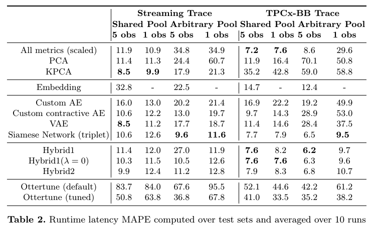

This [repository](https://github.com/udao-modeling/code) contains the code as
well as the datasets for the paper: "Neural-based Modeling for Performance
Tuning of Spark Data Analytics" authored by Khaled Zaouk, Fei Song, Chenghao Lyu
and Yanlei Diao.

## Requirements
Requirements for running the code in this repository are provided within the
file `requirements.txt`. We have used the code with Python 3.7.6

Apart from that, you just need to add the path of this directory to your
PYTHONPATH environment variable, so that calls to imports work fine. (Imports
that look like from sparkmodeling.common.etc... won't work until you add the
path of this directory to PYTHONPATH)

## Datasets
The locations of the workload traces datasets are:
- (1) Spark Streaming trace dataset: `datasets/streaming`
- (2) TPCx-BB over Spark trace dataset: `datasets/tpcx-bb`

Each folder contains multiple csv files. Each csv file corresponds to traces for
a particular workload. Since the number of files are limited to 1000 per folder
on github (if checking from browser), we have made the datasets downloadable at
this anonymous address as well:
https://drive.google.com/file/d/1k3klCqOWTlijn9wT0--NZ09fOWVTA1RM/view?usp=sharing
The compact URL of the dataset is: https://tinyurl.com/yc9z3lfz (MD5 checksum of
the zip file: ee9012770882d300b319a174900c0196)

This is because for TPCx-bb dataset we have 1160 workloads, and thus 1160 files.

## Preprocessing

Running the code under `preprocessing/streaming/make_and_run_all_tests.py` (for
streaming dataset) and under `preprocessing/tpcx-bb/make_and_run_all_tests.py`
(for tpcx-bb dataset) will produce the datastructures that are under:
`preprocessing/streaming/output/lods_mul.bin` and
`preprocessing/tpcx-bb/output/lods_mul.bin`. These are just serializations of
objects from the class `sparkmodeling.common.lodatastruct` which contain split
definitions (which workloads go to training+validation, which other workloads
are left as test workloads, which configurations are observed for test workloads
and which other configurations are used for evaluation, etc...)

There are no need to run the preprocessing code, as we provided the serialized
objects within this repository so that you get exactly the same split
definitions.

## Training and Evaluation

The training and evaluation code is under `experiments/streaming` and
`experiments/tpcx-bb`. Each of these directories contain a separate directory
per experiment, and these subdirectories have the same order that appears in the
paper.

Inside each of these subdirectories (such as
`experiments/streaming/4-autoencoders/3-vae/`) there are usually 3 files:
- config.py: which contains the configuration required for running the training
  and evaluation including the best hyper-parameters found and which we used to
  report the results. You should be mainly interested in changing 2 things within
  this configuration file:
    * 1) `N_OBS` (put to either `1` or `5`)
    * 2) `ENCODING_SCHEME` (put to either `shared` (which means configurations are used
    from the shared pool of traces) or `all` (which means configurations are selected
    from arbitrary pool of traces))
- train.py: this file contains instructions for training and evaluating the
  models by taking the configuration file into account.
- trainingutils.py: this file contains helper functions used within `train.py`

Running the training & evaluation code has produced the results we have put
in Table 2 (within the submission file of the paper):

## Hardware information
We trained our models using the provided code on a dedicated server of 20 nodes.
Each node has 2x Intel(R) Xeon(R) 65 Gold 6130 CPU @ 2.10GHz processors (with 16
cores per processor) and 754 GB of RAM.

Thus, our code is optimized to run with multiple processes to make advantage of
the multiple cores each node had. You may need to change the `N_WORKERS` within
configuration files if you are using less powerful machines.